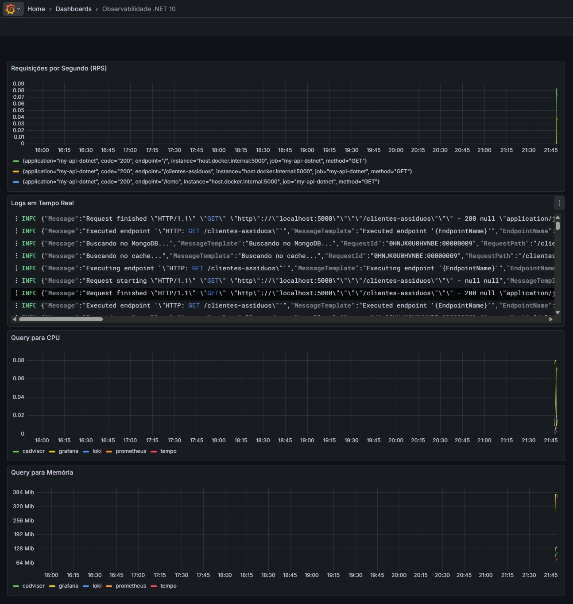
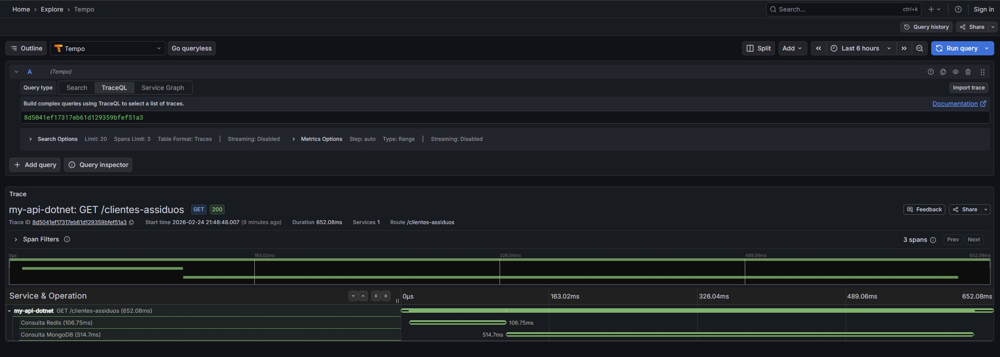

# 🚀 .NET 10 Full-Stack Observability Lab

Este projeto demonstra a implementação de uma estratégia de Observabilidade de Ponta a Ponta em uma Minimal API utilizando o ecossistema Grafana e o padrão OpenTelemetry (OTel).
O objetivo principal é correlacionar os três pilares da observabilidade (Métricas, Logs e Traces) para reduzir o MTTR (Mean Time To Resolution) em sistemas distribuídos.

---

## 🛠️ Tecnologias Utilizadas

- **Runtime:** .NET 10 (C#)
- **Métricas:** Prometheus (Coleta e armazenamento de séries temporais)
- **Logs:** Grafana Loki (Agregação de logs indexados por labels)
- **Traces:** Grafana Tempo (Rastreamento distribuído de alta performance)
- **Infraestrutura:** cAdvisor (Monitoramento de recursos de containers Docker)
- **Visualização:** Grafana (Dashboards unificados e correlação de dados)
- **Instrumentação:** OpenTelemetry SDK & Serilog

## 🏗️ Arquitetura do Lab (Desacoplada)

A solução utiliza o OTel Collector como um hub central de telemetria. Em vez de a API se comunicar com múltiplos destinos, ela envia todos os dados (Metrics, Logs e Traces) via protocolo OTLP (gRPC) para o Collector, que se encarrega de processar e distribuir os dados:

- **Unificação:** A API utiliza um único canal de saída (Porta 4317), reduzindo o overhead de rede e acoplamento.
- **Processamento em Pipeline:** O Collector utiliza processadores (batch, resource, attributes) para normalizar labels como application e service.name antes de persistir os dados.
- **Logs & Traces:** Correlacionados via TraceID injetado pelo Serilog e OpenTelemetry, permitindo o salto imediato do log para o gráfico de Gantt.
- **Métricas:** Convertidas e expostas pelo Collector para o scraping do Prometheus, utilizando convenções semânticas modernas do OTel.

## 🚀 Como Executar

Pré-requisitos:

- Docker Desktop
- .NET 10 SDK

### Passo a Passo

Clone o repositório:

```bash
git clone https://github.com/casamassa/study01observability
```

Suba a infraestrutura de observabilidade (certifique-se que o Docker Desktop esteja com a Engine running):

```bash
docker-compose up -d
```

Execute a API:

```bash
dotnet run --project .\myapi\
```

Gere tráfego acessando os endpoints disponíveis:

http://localhost:5000/

http://localhost:5000/clientes-assiduos

http://localhost:5000/lento

Obs. Este comando é usado para Parar a infraestrutura da observabilidade, útil quando encerrar o projeto para não deixar o Docker alocando memória:

```bash
docker compose down -v
```

## 📊 O que Observar (Destaques)

- **Dashboard 360°:** Acesse http://localhost:3000 (Login: admin/admin) para visualizar métricas de RPS, Logs em Tempo Real e consumo de CPU/Memória dos containers. Para criar esse Dashboard adicione um novo Dashboard, vá em Import e use o [json desse arquivo](https://github.com/casamassa/study01observability/blob/main/docker/grafana/dashboards/dashboard-360.json) para criar o Dashboard.
- **Navegação Log-to-Trace:** No painel de logs, clique no TraceID destacado em azul para ver a decomposição do tempo de execução (Sub-spans de Redis/MongoDB) no Grafana Tempo.
- **Infra Monitoring:** Gráficos de saúde do Docker alimentados pelo cAdvisor, integrados na mesma visão da aplicação.

### Screenshots

#### Dashboard 360



#### Gráfico de Gantt - Metrics - Tempo



## 🧠 Aprendizados e Evolução

Este laboratório permitiu o domínio de:

- Configuração de Provisioning (Data Sources e Dashboards como código).
- Escrita de queries avançadas em PromQL e LogQL.
- Resolução de desafios de infraestrutura (Docker Network, gRPC ports e Ingester Rings).

## 🧭 Próximos Passos (Roadmap)

O objetivo futuro é estender este laboratório para cenários de alta complexidade em microserviços:

- **Distributed Tracing (API A -> API B):** Implementar a propagação de contexto via headers W3C para rastrear uma transação que atravessa múltiplos serviços.
- **Async Tracing (RabbitMQ):** Testar a persistência do TraceContext em arquiteturas orientadas a eventos, garantindo a visibilidade desde a postagem na fila até o processamento no Worker.
- **Custom Metrics:** Adicionar instrumentação de negócio (ex: contagem de vendas, tempo de processamento de checkout) para dashboards executivos.

---

# Registro de como foi feito antes de automatizar a execução com Docker-compose

Mantive aqui minhas anotações de como eu estava executando antes de automatizar a subida dos containers.

## Como executar:

Subir os containers:

### 1- **Prometheus:**

```
docker run -d --name prometheus -p 9090:9090 -v "${pwd}/docker/prometheus.yml:/etc/prometheus/prometheus.yml" prom/prometheus:v3.9.1
```

### 2- **Loki:**

```
docker run -d --name loki -p 3100:3100 grafana/loki:2.9.4
```

### 3- **Tempo:**

```
docker run -d --name tempo -p 3200:3200 -p 4317:4317 -v "${pwd}/docker/tempo-config.yaml:/etc/tempo.yml" grafana/tempo:2.3.1 --config.file=/etc/tempo.yml --target=all
```

### 4- **Grafana:**

```
docker run -d --name grafana -p 3000:3000 grafana/grafana:12.3.2
```

### 5- Otel-Collector

```
docker run -d \
  --name otel-collector \
  --network observability \
  -v $(pwd)/docker/otel-collector-config.yaml:/etc/otel-collector-config.yaml \
  -p 4317:4317 \
  -p 8889:8889 \
  otel/opentelemetry-collector-contrib:0.111.0 \
  --config=/etc/otel-collector-config.yaml
```

### 6- **cAdvisor:**

_Para monitorar o "hardware" dos containers (CPU, Memória, Rede) e integrar isso ao dashboard de métricas, o padrão de mercado é o cAdvisor (Container Advisor) do Google.
Ele é um "agente" que roda como um container, lê as estatísticas do Docker e as expõe em um formato que o seu Prometheus já sabe ler._

```
docker run -d --name cadvisor -p 8080:8080 `  -v /:/rootfs:ro`
-v /var/run:/var/run:ro `  -v /sys:/sys:ro`
-v /var/lib/docker/:/var/lib/docker:ro `  --privileged`
--device /dev/kmsg `
gcr.io/cadvisor/cadvisor:v0.55.1
```

## GRAFANA Configurações manuais:

### 1. Configure a Fonte de Dados no Grafana:

1. Acesse http://localhost:3000 (user/pass: admin/admin).
2. Vá em Connections > Data Sources > Add data source.
3. Selecione Prometheus. -> Na URL, coloque http://host.docker.internal:9090. -> Clique em Save & Test
4. Selecione Loki. -> Na URL, coloque http://host.docker.internal:3100. -> Clique em Save & Test
5. Selecione Tempo. -> Na URL, coloque http://host.docker.internal:3200. -> Clique em Save & Test

### 2. No Grafana, configure a Ponte Final (Data Link)

Para o Grafana entender que aquele texto do TraceId é um link para o Tempo, faça o seguinte:

1. Vá em Connections > Data Sources > Loki.
2. Role até a seção Derived Fields.
3. Clique em + Add.
4. _Name:_ TraceID
5. _Regex:_ (?:TraceId|traceId|trace_id)":"(\w+)" (Isso extrai o ID do texto do log).
6. _Query:_ ${\_\_value.raw}
7. _Internal Link:_ Ative e selecione o Data Source Tempo.
8. Clique em Save & Test

### 3. Montar o Dashboard de Visão 360°! O objetivo é ter as métricas no topo e os logs logo abaixo, tudo filtrado pelo mesmo intervalo de tempo.

#### Criar o Dashboard:

1. No Grafana, vá em Dashboards -> New -> New Dashboard.

Criar o Gráfico de Métricas (Prometheus):

1. Clique em + Add Visualization.
2. Selecione o data source Prometheus.
3. No campo Query (PromQL), cole:

```promql
rate(http_server_request_duration_seconds_count{application="my-api-dotnet"}[1m])
```

4. No painel lateral direito (Panel options):
5. _Title:_ Requisições por Segundo (RPS)
6. _Graph styles:_ Mude para Line ou Area.
7. Clique em Apply/Save Dashboard.

#### Adicionar o Painel de Logs (Loki)

1. Clique em + (Add) Visualization.
2. Selecione o data source Loki.
3. No campo Query (LogQL), cole:

```logql
{application="my-api-dotnet"} |= ``
```

4. No painel lateral direito (Panel options):
5. _Title:_ Logs em Tempo Real
6. _Visualization:_ Procure por Logs (em vez de Time Series).
7. Clique em Apply/Save Dashboard.

#### Adicionar o Gráfico do CPU (cAdvisor)

1. Clique em + (Add) Visualization.
2. Selecione o data source Prometheus.
3. No campo Query (PromQL), cole:

```promql
sum(rate(container_cpu_usage_seconds_total{name!=""}[1m])) by (name)
```

4. No painel lateral direito (Panel options):
5. _Title:_ Query para CPU
6. Clique em Apply.

#### Adicionar o Gráfico de Memória (cAdvisor)

1. Clique em + (Add) Visualization.
2. Selecione o data source Prometheus.
3. No campo Query (PromQL), cole:

```promql
sum(container_memory_usage_bytes{name!=""}) by (name)
```

4. No painel lateral direito:
5. _Title:_ Query para Memória
6. _Standard options -> Unit_: Selecione Data -> bytes (IEC). (Como o container_memory_usage_bytes retorna o valor em Bytes, isso evita que o gráfico mostre números enormes, ex: 150.000.000, isso converterá automaticamente para MB ou GB,facilitando a leitura)
7. Clique em Apply.

#### Organizar e Salvar

1. Arraste o painel de Logs para ficar abaixo do gráfico de métricas.
2. Redimensione os painéis para ocuparem toda a largura da tela.
3. Clique no ícone de Disco Rígido (Save dashboard) no topo e dê o nome: Observabilidade .NET 10.

## OTEL-COLLECTOR Dicas Depuração:

URL: http://localhost:8889/metrics

Apresenta as métricas, dá pra pesquisar no texto se tal métrica está sendo gerada, por ex:

Busque por:

- http_server_request_duration_seconds_count ou
- http_server_request_duration_seconds_count{application="my-api-dotnet"}[1m]

## LOKI Dicas Depuração:

### 1. Verificar se o Loki recebeu "Labels":

URL: http://localhost:3100/loki/api/v1/labels

O que esperar:

- Um JSON contendo "values": ["application", ...].
- Se estiver vazio: O .NET não conseguiu enviar nada para o Loki.

### 2. Consultar os logs via API (O "Select" do Loki)

URL: http://localhost:3100/loki/api/v1/query_range?query={application="my-api-dotnet"} ({application="my-api-dotnet"} é variável definido dentro do [arquivo](https://github.com/casamassa/study01observability/blob/main/docker/prometheus.yml))

- Se retornar values com textos: Os logs estão no Loki! O problema é apenas a visualização no Grafana.
- Se retornar vazio: Os logs não saíram da API.

## TEMPO Dicas Depuração:

Cole o TraceID no final desta URL no seu navegador para testar se o tempo recebeu:

http://localhost:3200/api/traces/COLE_AQUI_O_TRACEID

## Comandos úteis do Docker:

- Reiniciar um container:

```
docker restart prometheus
```

- Parar um container:

```
docker stop prometheus
```

- Apagar um container:

```
docker rm -f prometheus
```
